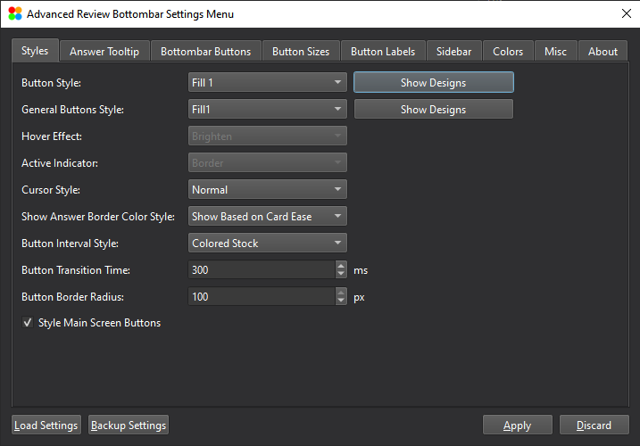
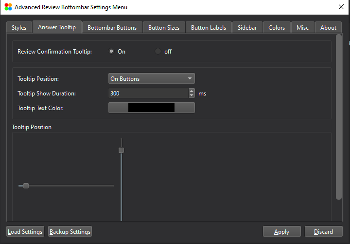
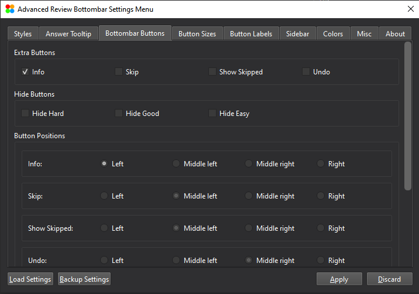
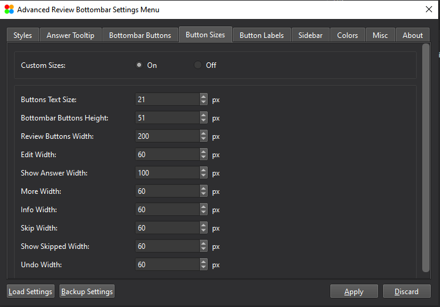
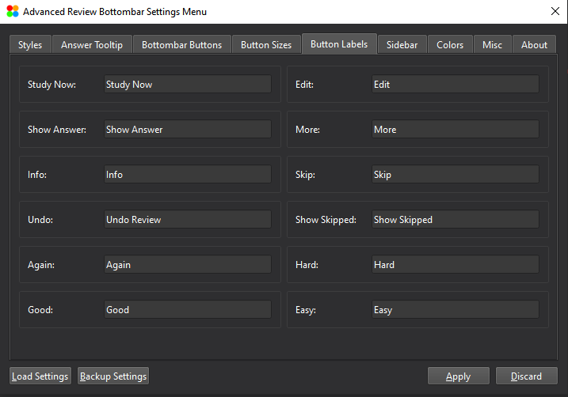
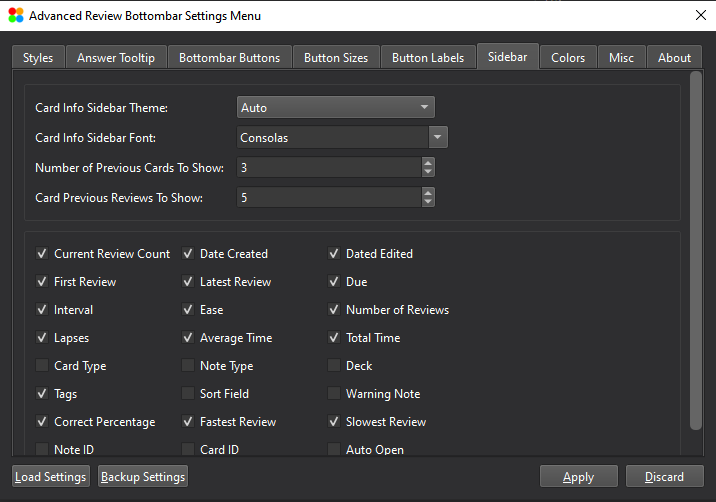
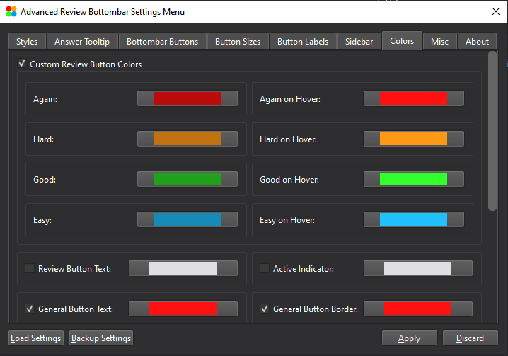
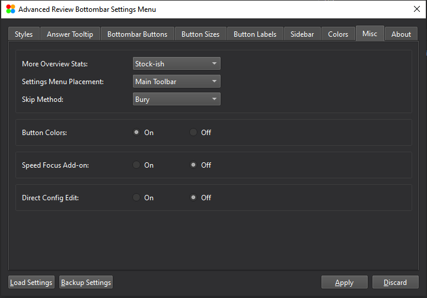

# Advanced Review Bottombar

Advanced Review Bottombar is an Anki add-on to customize and improve Anki's visual experience.

- [Installation](#installation)
    - [Using AnkiWeb](#using-ankiweb)
    - [Using the .ankiaddon file](#using-the-ankiaddon-file)
    - [Directly copying the add-on to Anki's add-ons folder](#directly-copying-the-add-on-to-ankis-add-ons-folder)
- [Features](#features)
  - [Change Styles of Buttons](#change-styles-of-buttons)
  - [Change Style of the Answer Tooltip](#change-style-of-the-answer-tooltip)
  - [Add, Remove or Change the Position of Bottombar Buttons](#add-remove-or-change-the-position-of-bottombar-buttons)
  - [Customize Button Sizes](#customize-button-sizes)
  - [Customize Button Labels](#customize-button-labels)
  - [Add Sidebar to Review Screen](#add-sidebar-to-review-screen)
  - [Customize Button Colors](#customize-button-colors)
  - [Miscellaneous](#miscellaneous)
- [Backup and Restore](#backup-and-restore)
- [Contribution](#contribution)
- [License](#license)
- [Changelog](CHANGELOG.md)

## Installation
You can use one of the following ways to install Advanced Review Bottmbar:

### Using AnkiWeb
The easiest and safest way to install ARBb is through Ankiweb. By installing ARBb through AnkiWeb you can automatically install the version of the add-on that is compatible with your version of Anki; As new version of ARBb may not be compatible with older versions of Anki.

**To install using AnkiWeb follow these steps:**

1. Open [Advanced Review Bottombar](https://ankiweb.net/shared/info/1136455830) add-on page on AnkiWeb and scroll to the download section.
  - You can see the supported versions of Anki in the download section of ARBb on AnkiWeb.
2. Copy the code that's in download section.
  - Instead of going to AnkiWeb you can copy `1136455830` and follow the steps 3 and 4.
3. Open anki, go to `Tools > Add-ons` and then click on `Get Add-ons...`
4. Paste the code that you copied from AnkiWeb there and click on `Ok`

### Using the .ankiaddon file
This is also an easy way to install ARBb but it doesn't guarantee that the version of the add-on that you install will be compatible with your version of anki. If you're using older versions of Anki I don't recommend you install the add-on using the add-on file.

If you want to install and specific version or an older version of the add-on, I recommend you use the `*.ankiaddon` file.

**To install using .ankiaddon file follow these steps:**

1. Go to [Rleases page](https://github.com/noobj2/Anki-Advanced-Review-Bottombar/releases) and find the version of the add-on that you want.
2. Click on the `*.ankiaddon` file and download it (you might have click on `Assets` to be able to see the `*.ankiaddon` file)
2. Locate the `*.ankiaddon` file on your PC and double click to install.

### Directly copying the add-on to Anki's add-ons folder
If you're not able to install the add-on using `AnkiWeb` and `.ankiaddon`, you can download the source code and copy it to the Anki add-ons folder.

**To install by directly copying add-on files to Anki add-ons folder follow these steps:**

1. Go to [Rleases page](https://github.com/noobj2/Anki-Advanced-Review-Bottombar/releases) and find the version of the add-on that you want.
2. Click on the `Source code (zip)` file and download it (you might have click on `Assets` to be able to see the `Source code (zip)` file)
3. Extract the zip file and copy the folder inside it to `C:\Users\YOUR_USERNAME\AppData\Roaming\Anki2\addons21`

  - You might need to re-name the extracted folder and delete the version code from the folder name. The folder containing the add-on files should be `Anki-Advanced-Review-Bottombar` instead of `Anki-Advanced-Review-Bottombar.VERSION_TAG`.

  - To open Anki add-ons folder you also can go to `Tools > Add-ons` and then click on `View Files`

## Features
Using this add-on, you can customize, improve and add new features to different parts of [Anki](https://apps.ankiweb.net/) desktop.

### Change Styles of Buttons

- Using **Button Style** you can change the style of review buttons
- Using **General Button Style** you can change the style of general buttons in deck browser and study screen
- Using **Hover Effect** you can change the effect of the buttons when you hover your mouse cursor over them
- Using **Active Indicator** you can change the effect that's applied to the selected button
- Using **Cursor Style** you can change the way your cursor looks when you hover it over a button
- Using **Show Answer Border Color Style** you can choose if you want the Show Answer button border to be a static color or if you want the color to indicate the ease of the card that's shown (you can change the colors for each ease range in **Colors** tab)
- Using **Button Interval Style** you can choose if you want the intervals that are shown above each button to be colored like the buttons of if you want them to be the default Anki style
- Using **Button Transition Time** you can change the animation time for certain button styles
- Using **Button Border Radius** you can choose the roundness of the buttons
- If you disable **Style Main Screen Buttons**, the styles will not be applied to the main screen (deck browser and study screen) buttons

### Change Style of the Answer Tooltip

In this tab you can customize the answer tooltip. Answer tooltip is a visual feedback that shows you the review button that you pressed. The tooltip will be displayed for a short time after you press each review button.
- Using **Review Confirmation Tooltip** you can enable or disable this feature
- Using **Tooltip Position** you can choose where you want the tooltip to be displayed after you review each card
  - If you choose **On Buttons**, the tooltip will be displayed on the button that you pressed
  - If you choose **Fixed Position**, the tooltip for all the buttons will be displayed on a fixed position; you can choose the position of the tooltip using the Tooltip Position sliders at the bottom of the tap
- Using **Tooltip Show Duration** you can choose for how long you want the tooltip to be displayed on the screen
- Using **Tooltip Text Color** you can change the color of the text that's inside each tooltip

### Add, Remove or Change the Position of Bottombar Buttons

In this tab, you can change add buttons to the review bottombar, remove buttons, change their position and also change the bottombar buttons' shortcuts.
- You can decide to show or hide each extra button on the bottombar by enabling or disabling it in the **Extra Buttons** section
- You can hide each review button in **Hide Buttons** section
- You can change the position of each extra button in the **Button Positions** section
- You can change each bottombar button's shortcut in the **Button Shortcuts** section

### Customize Button Sizes

You can change each button's size in the **Button Sizes** tab.
- You can enable or disable custom button sizes by turning **Custom Button Sizes** on or off
- You can change each button's size individually in this tab

### Customize Button Labels

You can change the text inside each button in this tab.
- You can translate the buttons to your local language
- You can also use emojis instead of text for review buttons

### Add Sidebar to Review Screen

Advanced Review Bottombar adds a sidebar in which you can see information about previous reviews of the cards to the review screen. In this tab, you can customize the sidebar.
- Using **Card Info Sidebar Theme** you can change the sidebar theme
- Using **Card Info Sidebar Font** you can change font of the text in sidebar
- Using **Number of Previous Cards To Show** you can determine how many of your previous cards you want to be in the sidebar
- Using **Card Previous Reviews To Show** you can determine how many of the previous reviews for a specific card to be shown on the sidebar
- You can disable or enable any of the option in this tab too so only the information that you want to see will be shown on the sidebar

### Customize Button Colors

In this tab you can change color of review buttons, general button, the text inside the button and also set the color shown for each ease range for the show answer border (refer to **Show Answer Border Style** in the **Styles** tab)
- If you want to use the default colors for the buttons, you can disable **Custom Review Button Colors**; if you do this, the colors will be grayed out and ARBb uses the default colors for the buttons
- If you want to choose your own colors, you have to first enable **Custom Review Button Colors**
- You can also change the color of the text inside the review buttons
- You can change color and the border color for general buttons
- You can also choose the color of the active indicator for certain button styles here (refer to **Active Indicator Style** in the **Styles** tab)
- You can choose the color for each ease range in this tab (refer to **Show Answer Border Style** in the **Styles** tab)

### Miscellaneous

In this tab you can find the settings that don't fall into other categories.
- In **More Overview Stats**, you can choose the style of the deck overview screen and the amount of information about the deck that's shown there
- You can also decide if you want the ARBb menu to be in the toolbar or if you want it to be a submenu of the `Tools`
- You can also choose the Skip method
- You can disable **Button colors** altogether; if you turn off button colors, all the stylings of the buttons will be disabled and you can use other add-ons for that without causing a conflict between ARBb and the other add-on
- If  you use speedfocus add-on, you should turn **Speed Focus Add-on** to make the add-ons work properly
- **Direct Config Edit** Enables you to see the values in config; I don't suggest enabling this option

## Backup and Restore Settings
You can Backup the settings before changing anything in the add-on so you can restore your settings at any point without going through all the options again.

You can also use the backup settings option to create different button color combinations and styles and change the styles easily anytime you want using a backup file.

## Contribution
- You can request new features or report bugs in the [Issues](https://github.com/noobj2/Anki-Advanced-Review-Bottombar/issues) section.

- You can improve the add-on or add new features or fix bugs if you want. Any pull request will be much appreciated.

- You can also rate this add-on [here](https://ankiweb.net/shared/review/1136455830) if you like the add-on.

## License
[GNU GENERAL PUBLIC LICENSE](LICENSE)
